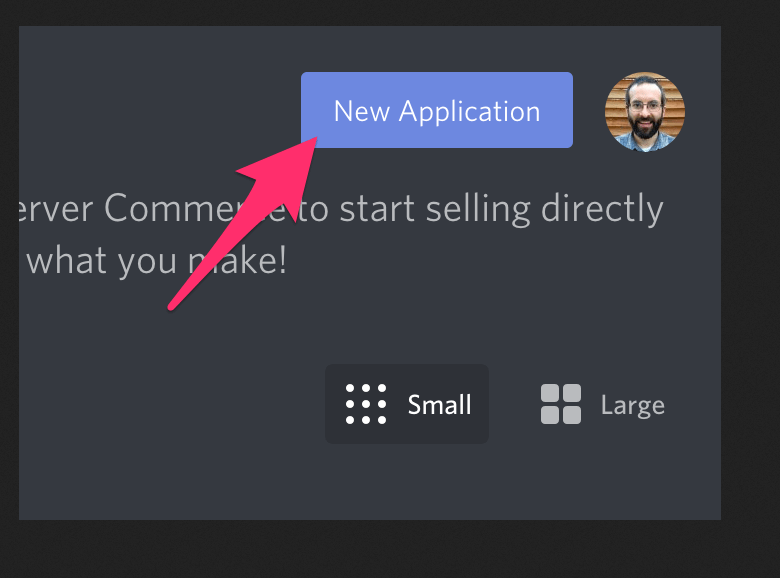
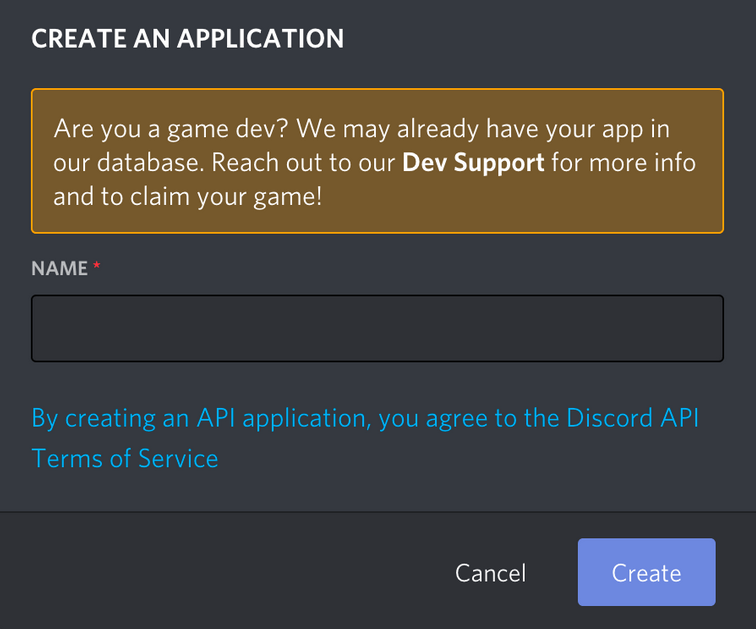
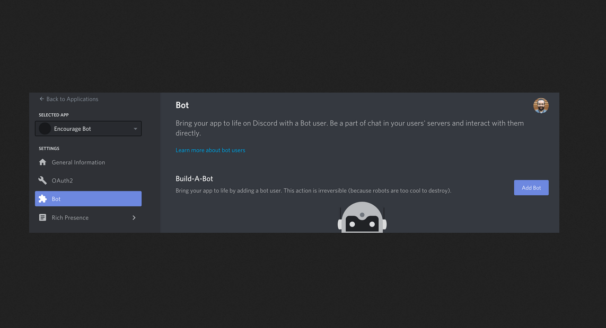
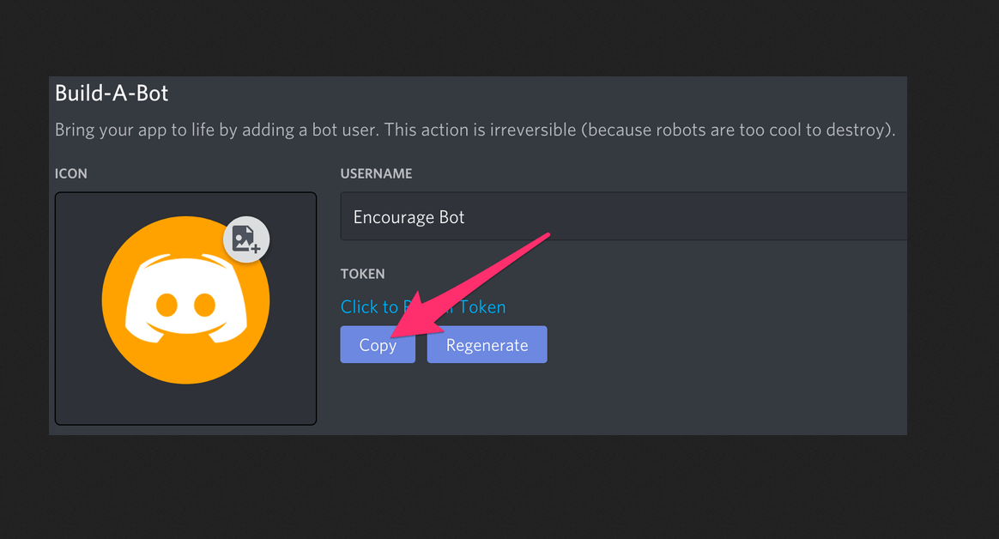
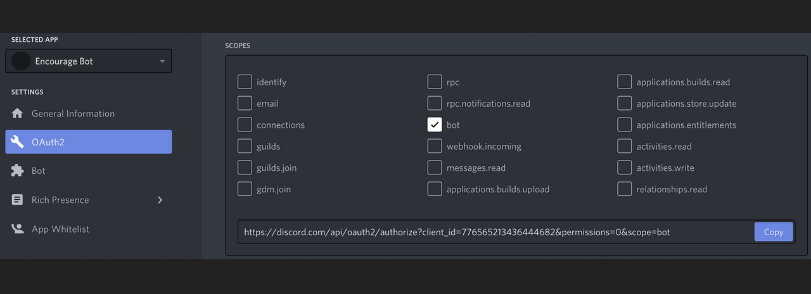
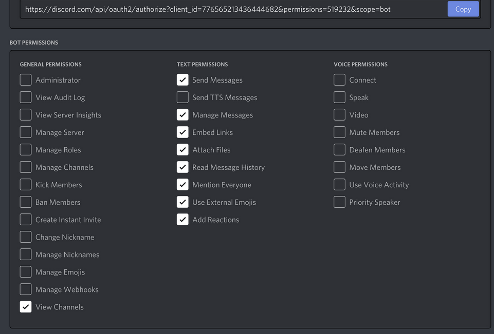
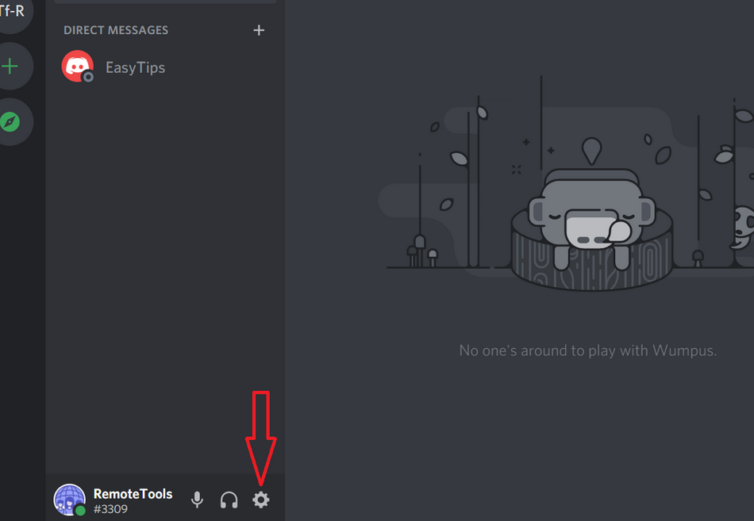
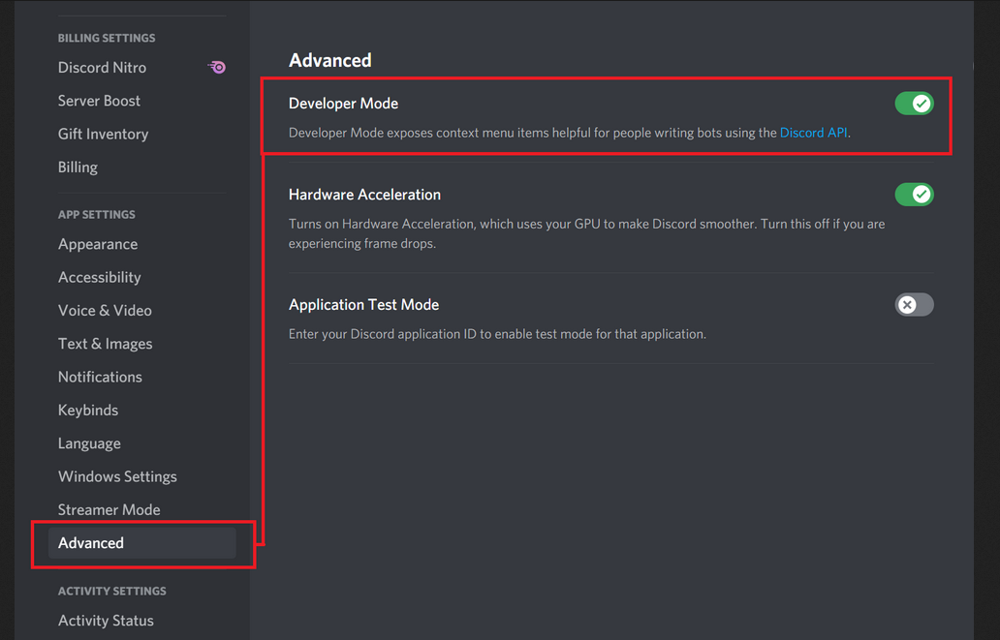
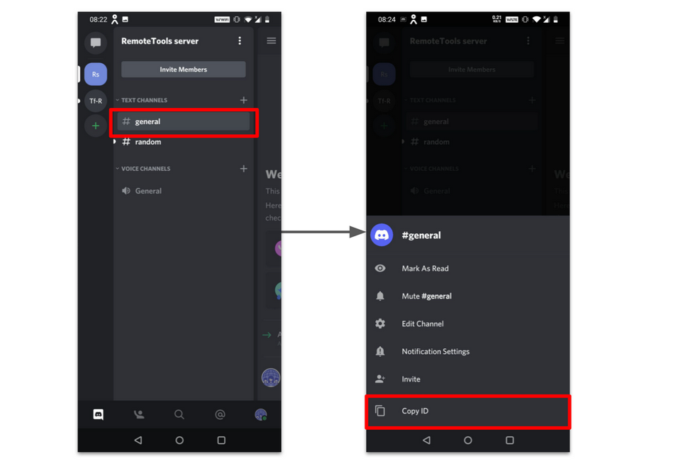

# A simple Discord Bot Client
  
*Created by: Mani*

**Programming language used: Python**

**Tested on: Debian (linux)**

## Table of Contents

* [Requirements](#requirements)
* [How to install modules](#how-to-install-modules)
   * [For Windows:](#for-windows)
   * [For Linux/Mac:](#for-linuxmac)
* [How to run the program](#how-to-run-the-program)
   * [For Windows (CLI):](#for-windows-cli)
   * [For Linux/Mac (CLI):](#for-linuxmac-cli)
   * [For IDLE:](#for-idle)
* [About this Program](#about-this-program)
* [How to reset default bot token and channel ID](#how-to-reset-default-bot-token-and-channel-id)
* [How to create a bot and get a bot token](#how-to-create-a-bot-and-get-a-bot-token)
   * [How to create a discord bot](#how-to-create-a-discord-bot)
   * [How to get bot token](#how-to-get-bot-token)
   * [How to invite a bot to a server](#how-to-invite-a-bot-to-a-server)
* [How to get Channel ID of a channel in discord](#how-to-get-channel-id-of-a-channel-in-discord)
* [Possible errors and issues related to program](#possible-errors-and-issues-related-to-program)

## Requirements

* Python (v 3.7.x and above) \[**Note: The program hasn't been tested below python v 3.7.x**\]
* Shell/terminal (Much prefered over IDLE)
    (**Note: The program won't work as expected on IDLE.**)
    * For IDLE: run the file ([chat.py](IDLE/chat.py)) present in the "IDLE" folder
    * For Command Line(Terminal/Powershell/cmd): run the file ([chat.py](shell/chat.py)) in the "shell" folder
* Modules:
   * colorama==0.4.4  (*Not Required for script inside "IDLE" folder*)
   * discord.py==1.7.3
   * discord==1.7.3
   * python-dotenv==0.19.0
* Stable internet connection
* Discord bot token
* A channel ID (**The discord bot should be able to interact in the channel!**)

## How to install modules

#### For Windows:
* Navigate to the directory of the python file(`shell\` or `IDLE\`) in cmd/powershell
* Run either one of the following commands:
   * `pip3 install -r requirements.txt` 
   * `pip install -r requirements.txt`

#### For Linux/Mac:

* Navigate to the directory of the python file(`shell/` or `IDLE/`) in terminal
* Run either one of the following commands:
   * `pip3 install -r requirements.txt` 
   * `pip install -r requirements.txt`

## How to run the program

#### For Windows (CLI):

* Navigate to the `shell\` directory in cmd/powershell
* Run either one of the following commands:
   * `py chat.py` or `python3 chat.py`

#### For Linux/Mac (CLI):

* Navigate to the `shell/` directory in terminal
* Run the following command:
   * `python3 chat.py`

#### For IDLE:

* Navigate to the `IDLE` directory in any file manager/explorer
* Right click and select open it in IDLE
* Press F5 or choose Run Tab > Run Module 

## About this Program

This python program allows you to send messages via your bot to a channel.

There are 2 scripts:
   * chat.py (in [shell](shell/) folder)
   * chat.py (in [IDLE](IDLE/) folder)

For command line (if you are running the file in terminal/cmd/powershell), run the file ([chat.py](shell/chat.py)) present in `shell` folder and
for IDLE, run the file ([chat.py](IDLE/chat.py)) present in `IDLE` folder

A bot token is required to be able to send messages. The program accepts only one bot token at a time. 

A channel ID is required for a bot to be able to chat on the given channel.
The program accepts one default bot token and also one temporary bot token that needs to be entered each time you enter option 2.
The default channel ID and bot token will be saved in the .env file

While in the "main option console", you can enter either of the below:
   * Enter 1 to send messages in the default channel
   * Enter 2 to chat in a different channel (You need to provide the channel ID for this)
   * Enter 3 to exit program

While in the "message console", the below will give respective responses:
   * Type /help and enter to display help message
   * Type /prev and enter to go back to previous menu
   * Type /clean to clean the terminal (this won't work in IDLE)
   * Type /quit to exit program

Also **note that, the bot must be present in the guild/server of the given channel ID and the bot must be able to interact in the given channel ID**

The interpreter will act as your message console.

## How to reset default bot token and channel ID

* Once you run the chat.py, automatically a file named .env will be created on the same folder
* Delete the .env file and re run the program to add a new bot token and channel ID

**NOTE: The .env file will be hidden on linux/mac until you type** `ls -a` **in terminal or allow file manager/explorer to view hidden files**

Use `rm -f .env` (while being on the same directory) to delete the file in terminal on linux/mac 

## How to create a bot and get a bot token

#### How to create a discord bot

* Make sure you’re logged on to the [Discord website](https://discord.com/)
* Navigate to the [application page](https://discord.com/developers/applications)
* Click on the “New Application” button.
 
* Give the application a name and click “Create”.

* Go to the “Bot” tab and then click “Add Bot”. You will have to confirm by clicking "Yes, do it!"

* Keep the default settings for Public Bot (checked) and Require OAuth2 Code Grant (unchecked).

#### How to get bot token

* Your bot has been created. The next step is to copy the token.

* This token is your bot's password so don't share it with anybody. You can regenerate the token if it accidentally gets shared.

#### How to invite a bot to a server

* To add a bot to server, you should create an invite URL for it.
* Go to the "OAuth2" tab. Then select "bot" under the "scopes" section.

* Now choose the permissions you want for the bot. 
The bot is going to mainly use text messages (in this program) so select the necessary under test permissions
 \[**Be careful with the "Administrator" permission.**\]

* After selecting the appropriate permissions, click the 'copy' button above the permissions. 
That will copy a URL which can be used to add the bot to a server.
* Paste the URL into your browser, choose a server to invite the bot to, and click “Authorize”.
\[**To add the bot, your account needs "Manage Server" permissions.**\]

## How to get Channel ID of a channel in discord

* Make sure developer mode is enabled in discord by following the below steps:
   * Click on ‘User Settings’ (the gear icon next to your Discord avatar)
    
   * In the left sidebar, click on ‘Advanced’ > Click on the ‘Developer Mode’ toggle to turn it on
    
* To find the Channel ID, press and hold on the channel name and select ‘Copy ID’.
 

## Possible errors and issues related to program

* The program doesn't run as expected in the IDLE (Try running it in terminal, if so use the [chat.py](shell/chat.py) in the `shell` folder)
* Connection issues while the program is running, might throw unexpected errors
* Editing the .env file might throw unexpected errors (If so, delete the .env file and re run the program)
* Program hasn't been tested on windows or mac, however there is no gurantee it will work as expected on **windows**!

